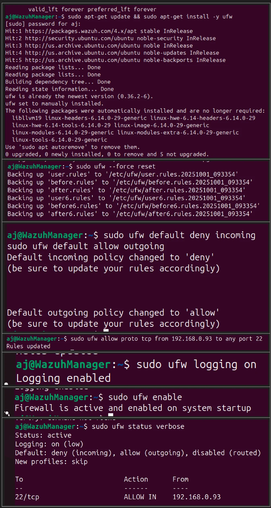
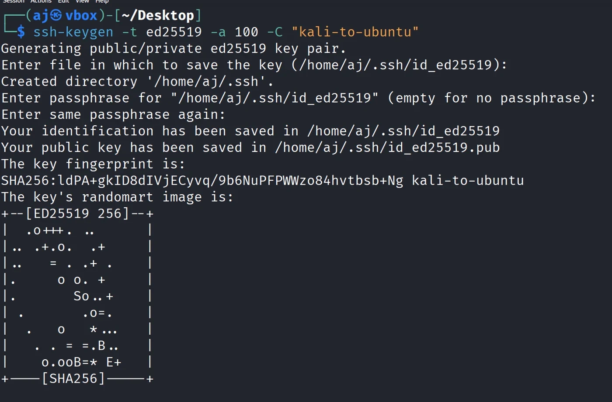
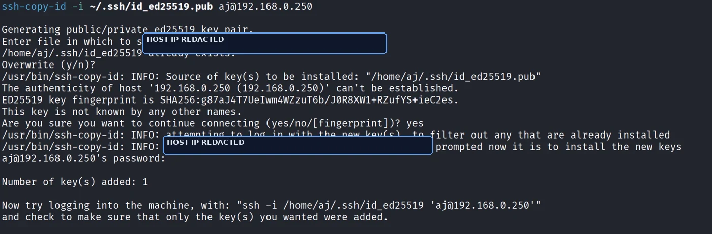
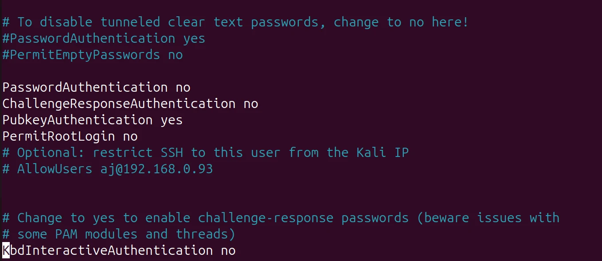
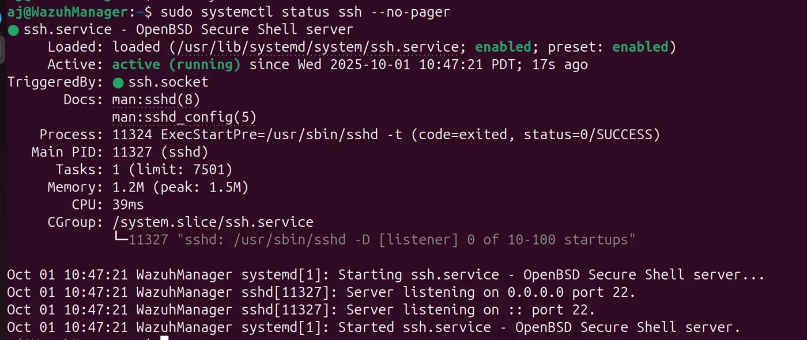
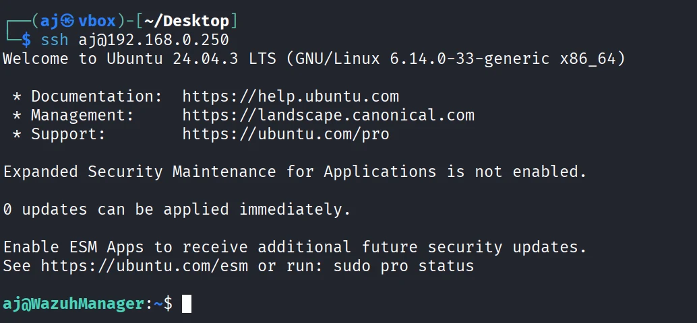
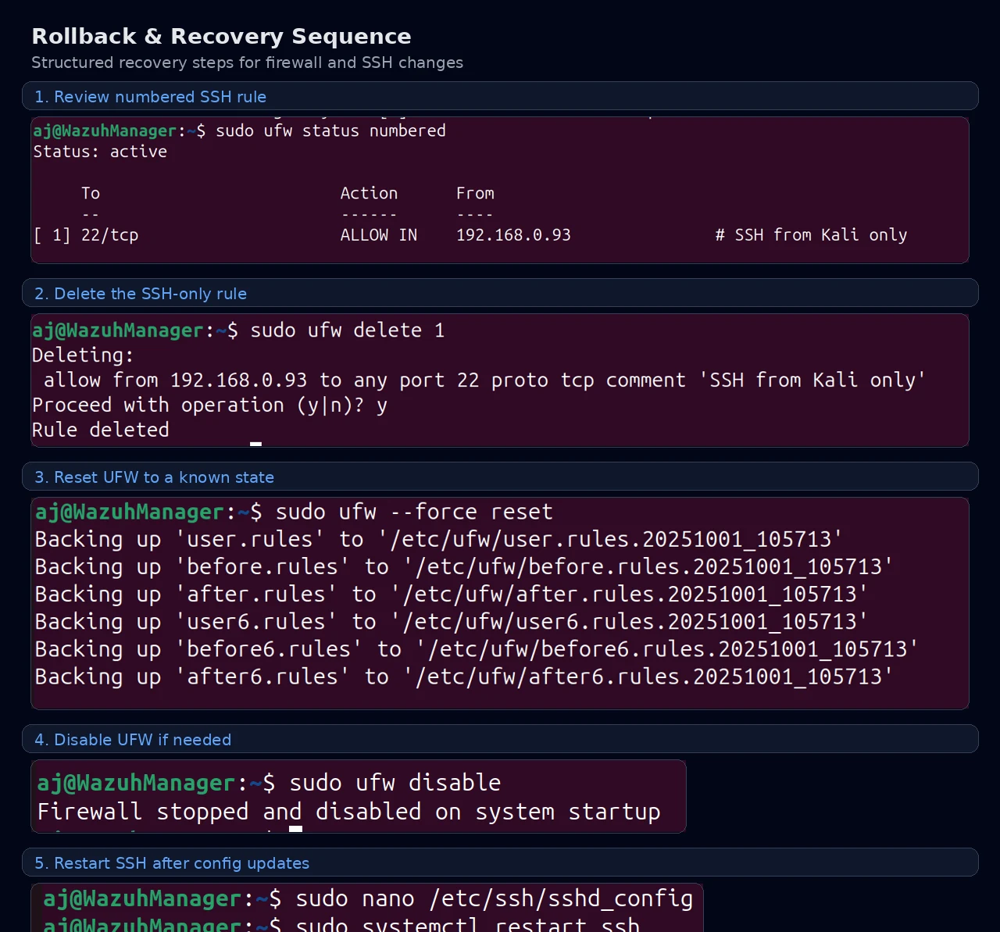

# Linux Hardening & Secure Access Control

## Executive Summary

This project implements a secure Linux remote-administration baseline using **UFW default-deny firewall rules**, **SSH key-only authentication**, **restricted access from a trusted administrative host**, **service validation**, and **documented rollback procedures**.

The objective was not just to harden a host. It was to demonstrate a full operational workflow: identify the exposure, apply the controls, verify that legitimate administration still works, and leave behind recovery steps another analyst or administrator could follow safely.

> **Recruiter takeaway:** This project demonstrates least privilege, secure remote administration, Linux hardening, change discipline, validation, and recovery planning — all directly relevant to SOC, IT Security, Endpoint Security, and Detection-focused roles.

## Project Links

- **Portfolio case study:** https://aaronjohnson.tech/linux-hardening-secure-access.html
- **Portfolio homepage:** https://aaronjohnson.tech
- **GitHub repository:** https://github.com/aaronjohnsontech/linux-hardening-secure-access

## Problem

Linux systems commonly expose SSH for remote administration. If SSH is left broadly reachable or still allows password-based authentication, it increases the risk of brute-force activity, credential stuffing, unauthorized access, and operational disruption.

This project addresses that risk by moving the host to a more defensible baseline:

- deny inbound traffic by default
- allow only the required administrative path
- restrict SSH to a trusted source
- move authentication to SSH keys
- disable password-based login and root login
- document rollback steps before considering the change complete

## Environment

| Component | Role |
|---|---|
| Ubuntu / Wazuh Manager host (`192.168.0.250`) | System being hardened |
| Kali Linux host (`192.168.0.93`) | Trusted administrative / test host |
| UFW | Host firewall control |
| OpenSSH Server | Remote administration service |
| ED25519 SSH key | Key-based authentication |
| `systemctl`, SSH client, firewall status output | Validation evidence |

## Control Outcomes

- **Default-deny inbound policy** established with outbound traffic allowed.
- **SSH limited to one trusted source IP** instead of broad network exposure.
- **ED25519 key pair generated** and public key installed on the target host.
- **PasswordAuthentication set to `no`**, **PubkeyAuthentication kept at `yes`**, and **PermitRootLogin set to `no`**.
- **SSH service validated** after configuration changes.
- **Rollback path documented** for both UFW and SSH configuration changes.

## Implementation Overview

1. Validate or install UFW, then reset it to a known state.
2. Apply **default deny incoming** and **default allow outgoing** policies.
3. Allow TCP/22 only from the trusted Kali administrative host.
4. Enable UFW logging and verify the final rule state.
5. Generate an ED25519 key pair on the administrative host.
6. Use `ssh-copy-id` to install the public key on the Ubuntu host.
7. Back up `sshd_config` and harden SSH by disabling password login and root login.
8. Restart SSH and confirm that the service is healthy.
9. Validate passwordless administrative access from the trusted host.
10. Document rollback steps to remove the SSH rule, reset or disable UFW, and recover SSH configuration if necessary.

## Evidence Highlights

### Topology


### Firewall Baseline



### SSH Key Generation and Deployment

| Key generation | Public key installation |
|---|---|
|  |  |

### SSH Hardening and Validation

| SSH config hardening | SSH service validation | Passwordless login validation |
|---|---|---|
|  |  |  |

### Rollback & Recovery



## Repository Structure

```text
linux-hardening-secure-access/
├── README.md
├── docs/
│   ├── case-study.md
│   ├── implementation-guide.md
│   ├── validation-checklist.md
│   ├── rollback-plan.md
│   ├── security-rationale.md
│   ├── interview-talking-points.md
│   └── publishing-checklist.md
├── configs/
│   ├── sshd_config_hardening_example.conf
│   └── ufw-baseline-commands.md
├── scripts/
│   ├── ufw-default-deny-baseline.sh
│   └── ssh-hardening-check.sh
├── evidence/
│   ├── diagrams/
│   │   └── linux-hardening-architecture.svg
│   ├── redacted-notes/
│   └── screenshots/
└── website/
    ├── linux-hardening-case-study.html
    └── project-card-snippet.html
```

## Skills Demonstrated

- Linux security hardening
- Host firewall configuration
- SSH access control
- Least privilege
- Secure remote administration
- Validation and troubleshooting
- Rollback planning
- Security documentation
- Operational risk reduction

## Safety Notice

Do not apply firewall or SSH hardening changes on a system you cannot recover through console access, snapshot restore, or out-of-band management. Review the rollback plan before making remote-access changes.
